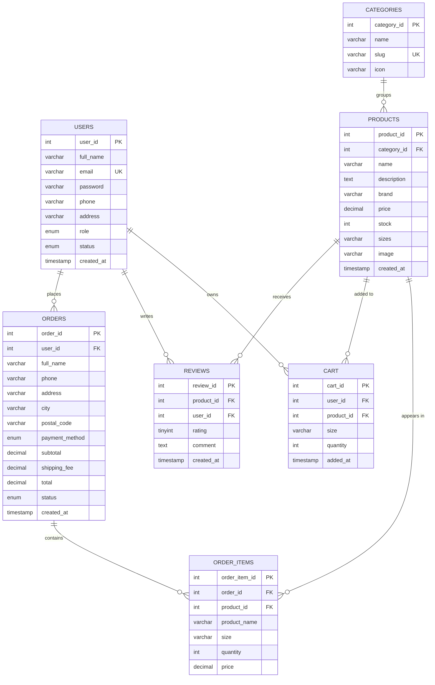

<!--
  ============================================================
  HOW TO USE THIS FILE
  ------------------------------------------------------------
  This is the Section B Technical Report for the SportZone project.
  It is written in Markdown so you can paste it into Microsoft Word
  or Google Docs (or export to PDF) and apply your university template.

  PLACEHOLDERS you must complete manually are marked with  >> [ACTION] <<
  Mainly: the MMU logo image and the screenshots.
  ============================================================
-->

<div align="center">

>> [ACTION] Insert the MMU University logo image here (see docs/mmu-logo-placeholder.txt) <<


# MULTIMEDIA UNIVERSITY

## WEB APPLICATION DEVELOPMENT (CIT6224)

### SYSTEM DEVELOPMENT & TECHNICAL REPORT (SECTION B)

# SPORTZONE
### Sports Equipment & Apparel E-Commerce System

**Group 16 — TC2L**

| Student Name | Student ID | Role |
|---|---|---|
| Hadi Abdulla | 242UC243PP | Authentication & User Management Specialist |
| Ahmed Mahmoud Mohamed | 243UC245XT | Product Catalog & Display Specialist |
| Osman Omer Gumaa | 243UC245R0 | Shopping Cart & Order Processing Specialist |
| Mohamed Tarek | 242UC2435F | Admin Panel & Management Specialist |

**Submission (Week 12): 21/06/2026**

</div>

<div style="page-break-after: always;"></div>

## Table of Contents
1. Introduction and Project Background
2. Development Methodology
3. System Architecture and Technologies Used
4. Database Design (ERD, Relationships, Normalization)
5. System Design and Implementation Details
6. Feature Explanations (with Screenshots)
7. Security Implementation
8. Testing
9. User Guide
10. Conclusion and Future Enhancements
11. References

<div style="page-break-after: always;"></div>

---

## 1. Introduction and Project Background

### 1.1 Background
In the modern digital economy, e-commerce platforms are fundamental to business scalability
and operational efficiency. Traditional sports retail is constrained by store operating hours,
limited shelf space, lack of real-time stock visibility, and geographic reach. **SportZone** was
developed to address these gaps by providing an intuitive, secure and comprehensive online
sports retail platform.

### 1.2 Project Overview
SportZone is a **Business-to-Consumer (B2C)** online store specialising in sports equipment,
apparel and fitness accessories across five categories — **Football, Basketball, Running, Gym and
Sportswear**. Customers can browse and search products, read and write reviews, manage a shopping
cart, and place orders through a multi-step checkout. Administrators manage the catalogue, orders
and users through a dedicated role-protected admin panel.

### 1.3 Objectives
1. Develop a fully functional e-commerce platform for sports products.
2. Implement secure user registration and **role-based authentication** (Customer and Admin).
3. Provide intuitive product browsing with advanced search and filtering.
4. Enable a seamless shopping cart and checkout experience.
5. Provide comprehensive administrative tools for product and order management.
6. Ensure a responsive design across desktop, tablet and mobile devices.

### 1.4 Target Users
University/school students, amateur and professional athletes, fitness enthusiasts, casual
participants, and sports teams/clubs requiring convenient online access to sports gear.

---

## 2. Development Methodology

The team adopted the **Agile** methodology, delivering the system incrementally over six sprints.
Agile was chosen for its iterative nature, flexibility to adapt to technical challenges, support
for parallel teamwork, and alignment with the structured assignment milestones (Week 6 proposal,
Week 12 final submission).

| Sprint | Duration | Deliverable |
|---|---|---|
| Sprint 1 | Weeks 1–2 | Project proposal, wireframes, team formation |
| Sprint 2 | Weeks 3–4 | Database design (ERD), initial frontend templates |
| Sprint 3 | Weeks 5–7 | Core frontend development (HTML/CSS pages) |
| Sprint 4 | Weeks 8–9 | Backend development (PHP logic, DB integration) |
| Sprint 5 | Weeks 10–11 | Integration, security implementation, testing |
| Sprint 6 | Week 12 | Documentation, video presentation, final submission |

**Collaboration tools:** GitHub (version control), shared task board, Google Drive (docs), and a
group chat for daily coordination. Consistent naming conventions and shared reusable includes
(`config.php`, `db_connect.php`, `header.php`, `footer.php`, `functions.php`) minimised
integration conflicts between members.

---

## 3. System Architecture and Technologies Used

### 3.1 Architecture
SportZone follows a classic **three-tier architecture**:

```
   ┌─────────────────────────────────────────────────────────┐
   │  PRESENTATION TIER  (Client)                              │
   │  HTML5 · CSS3 (custom) · Vanilla JavaScript               │
   │  Responsive UI, client-side validation, canvas chart      │
   └───────────────────────────┬─────────────────────────────┘
                               │  HTTP (forms / GET / POST)
   ┌───────────────────────────▼─────────────────────────────┐
   │  APPLICATION TIER  (Server)                               │
   │  PHP on Apache (XAMPP)                                     │
   │  Auth & sessions · business logic · validation · CRUD     │
   │  Reusable includes: config, db_connect, functions,        │
   │  header, footer                                           │
   └───────────────────────────┬─────────────────────────────┘
                               │  mysqli + prepared statements
   ┌───────────────────────────▼─────────────────────────────┐
   │  DATA TIER                                                │
   │  MySQL (sportzone_db) — 7 related tables                  │
   └─────────────────────────────────────────────────────────┘
```

### 3.2 Technology Stack
| Layer | Technology | Purpose |
|---|---|---|
| Markup | HTML5 | Semantic page structure |
| Styling | CSS3 (custom, no frameworks) | Visual design, responsive layout (Flexbox/Grid) |
| Scripting | Vanilla JavaScript | Client-side validation, interactivity, canvas chart |
| Server | PHP | Business logic, authentication, DB operations |
| Database | MySQL | Persistent data storage |
| Server env. | XAMPP (Apache + MySQL) | Local development & hosting on Windows |

> **Constraint compliance:** No UI frameworks (Bootstrap, Tailwind, Foundation, Bulma) and no
> JavaScript libraries were used. The dashboard sales chart is drawn manually on an HTML5
> `<canvas>` element with custom JavaScript.

### 3.3 Reusable Server-Side Includes
| File | Responsibility |
|---|---|
| `includes/config.php` | Session start, site constants, DB credentials |
| `includes/db_connect.php` | mysqli connection (UTF-8) |
| `includes/functions.php` | Helpers: `sanitize()`, auth checks, CSRF, flash messages, cart count, ratings |
| `includes/head.php` | `<head>` + opening `<body>` |
| `includes/header.php` | Navbar, search bar, category menu, cart badge |
| `includes/footer.php` | Footer + script includes |
| `admin/includes/admin_header.php` / `admin_footer.php` | Admin layout (sidebar + topbar) |

This satisfies the requirement to *"use PHP to include common webpage code (menu, header, footer)."*

---

## 4. Database Design

### 4.1 Entity Relationship Diagram (ERD)

The database `sportzone_db` consists of **seven** related tables. The ERD below is written in
Mermaid syntax (renders on GitHub / many Markdown viewers). A textual version follows for tools
that do not render Mermaid.



**Textual ERD (relationships):**
- `categories` (1) ──< `products` (M)
- `users` (1) ──< `orders` (M) ──< `order_items` (M) >── (1) `products`
- `users` (1) ──< `reviews` (M) >── (1) `products`
- `users` (1) ──< `cart` (M) >── (1) `products`

> **Note:** A screenshot of the ERD generated from phpMyAdmin (Designer view) or draw.io can be
> inserted here for the report.
>
> >> [ACTION] Insert ERD screenshot/diagram image here. <<

### 4.2 Table Descriptions
| Table | Purpose | Key columns |
|---|---|---|
| `users` | Stores customers **and** admins (role-based) | `role` (customer/admin), `status` |
| `categories` | Product categories | `slug` (URL-friendly), `icon` |
| `products` | Product catalogue | `category_id` (FK), `price`, `stock` |
| `reviews` | Customer ratings & comments | `rating` (1–5), FKs to product & user |
| `cart` | Persistent per-user cart | FKs to user & product, `size`, `quantity` |
| `orders` | Order header + shipping + totals | `status`, `payment_method`, `total` |
| `order_items` | Line items per order (price snapshot) | FK to order; `product_name`/`price` stored at purchase time |

### 4.3 Normalization
The schema is normalised to **Third Normal Form (3NF)**:
- **1NF:** All columns hold atomic values; each table has a primary key.
- **2NF:** No partial dependencies — every non-key attribute depends on the whole primary key
  (e.g., `order_items` attributes depend on `order_item_id`).
- **3NF:** No transitive dependencies — product details live in `products`, category details in
  `categories`; orders reference users by `user_id` rather than duplicating user data.

**Deliberate denormalization for integrity:** `order_items` stores `product_name` and `price` at
the time of purchase. This preserves historical order accuracy even if a product is later renamed,
repriced, or deleted (the FK uses `ON DELETE SET NULL`). This is standard, intentional e-commerce
practice rather than a normalization flaw.

### 4.4 Referential Integrity
Foreign keys enforce integrity with appropriate cascade rules:
- Deleting a category cascades to its products (`ON DELETE CASCADE`).
- Deleting a user cascades to their cart, reviews and orders.
- Deleting a product sets `order_items.product_id` to `NULL` (history preserved).
- A `CHECK` constraint restricts `reviews.rating` to 1–5.

---

## 5. System Design and Implementation Details

Work was divided so each of the four members owns **three pages and three features**, satisfying
the individual-assessment constraint.

### 5.1 Member 1 — Hadi Abdulla · Authentication & User Management
**Pages:** `login.php`, `register.php`, `profile.php`
**Features:** registration system, login & session management, profile management.

- **Registration** performs server-side validation (name format/length, valid email, password
  length, password match, terms acceptance) *and* checks email uniqueness with a prepared
  statement. Passwords are hashed with `password_hash()` (bcrypt). Client-side JS
  (`auth.js`) gives real-time feedback before submission.
- **Login** verifies credentials with `password_verify()`, checks account `status`,
  regenerates the session ID (prevents session fixation), stores `user_id`, `full_name` and
  `role`, then redirects by role (admin → dashboard, customer → home).
- **Profile** lets users edit their name/phone/address and change their password (re-verifying the
  current password first).

### 5.2 Member 2 — Ahmed Mahmoud Mohamed · Product Catalog & Display
**Pages:** `index.php`, `products.php`, `product-details.php`
**Features:** product browsing & categorization, search & filter system, reviews & ratings.

- **Listing** supports keyword **search** (name/brand/description), **category** filter, **brand**
  filter, **price range**, **sorting** (newest, price asc/desc, name) and **pagination** — all
  built with a dynamically assembled but **fully parameterised** SQL query.
- **Product details** shows the image, average rating, stock, description tabs, a related-products
  carousel, and an interactive **star-rating review form** (logged-in users only). Reviews are
  inserted via prepared statements and rendered with escaped output.

### 5.3 Member 3 — Osman Omer Gumaa · Shopping Cart & Order Processing
**Pages:** `cart.php`, `checkout.php`, `orders.php`
**Features:** shopping cart system, checkout & order placement, order tracking.

- **Cart** is persisted in the `cart` table per user (add, update quantity, remove, clear) with
  live subtotal/shipping/total calculation and stock clamping.
- **Checkout** is a **multi-step form** (Shipping → Payment → Review) with client-side validation
  and a server-side re-validation in `place_order.php`. Order creation runs inside a **database
  transaction** that inserts the order + items, **decrements stock**, and clears the cart — rolling
  back on any error.
- **Order tracking** lists the customer's orders with status badges and a details modal.

### 5.4 Member 4 — Mohamed Tarek · Admin Panel & Management
**Pages:** `admin/dashboard.php`, `admin/products.php` (+ `product-form.php`), `admin/orders.php`
**Features:** dashboard analytics, product CRUD with image upload, order management.

- **Dashboard** shows totals (products, customers, orders, revenue), a **custom canvas line chart**
  of the last 7 days of sales, recent orders, and low-stock alerts.
- **Product CRUD** supports create/read/update/delete with secure **image upload** (MIME-checked,
  size-limited, randomised filename) and live preview.
- **Order management** lists/filters orders and updates their status; **category** and **user**
  management modules round out the panel. All admin pages are protected by `require_admin()`.

---

## 6. Feature Explanations (with Screenshots)

> Capture each screenshot from your running XAMPP instance and replace the placeholder lines.
> Suggested filenames are given so the report stays organised.

### 6.1 Home Page
Hero banner, category grid and featured products fetched dynamically from the database.
>> [ACTION] Insert screenshot: `screenshots/01-home.png` <<

### 6.2 Product Listing — Search, Filter, Sort, Pagination
Sidebar filters (category, price, brand), sort dropdown, and pagination.
>> [ACTION] Insert screenshot: `screenshots/02-products.png` <<

### 6.3 Product Details & Reviews
Image, stock, description/review tabs, interactive star rating, related products.
>> [ACTION] Insert screenshot: `screenshots/03-product-details.png` <<

### 6.4 Registration & Login (with validation)
Real-time client-side validation + PHP server-side validation with feedback messages.
>> [ACTION] Insert screenshot: `screenshots/04-register.png` and `05-login.png` <<

### 6.5 Shopping Cart
Editable quantities, remove items, live totals, order summary.
>> [ACTION] Insert screenshot: `screenshots/06-cart.png` <<

### 6.6 Multi-Step Checkout & Order Confirmation
Shipping → Payment → Review steps and the success page.
>> [ACTION] Insert screenshot: `screenshots/07-checkout.png` and `08-order-success.png` <<

### 6.7 Order History & Tracking
Customer order list with status badges and details modal.
>> [ACTION] Insert screenshot: `screenshots/09-orders.png` <<

### 6.8 Admin Dashboard
Statistics cards, sales chart, recent orders, low-stock alerts.
>> [ACTION] Insert screenshot: `screenshots/10-admin-dashboard.png` <<

### 6.9 Admin Product CRUD & Order Management
Product list with edit/delete, add/edit form with image upload, order status updates.
>> [ACTION] Insert screenshot: `screenshots/11-admin-products.png` and `12-admin-orders.png` <<

### 6.10 Responsive Design
The same pages on mobile width (hamburger nav, stacked layout, filter drawer).
>> [ACTION] Insert screenshot: `screenshots/13-responsive.png` <<

---

## 7. Security Implementation

| Threat | Mitigation in SportZone |
|---|---|
| **SQL Injection** | **All** queries use mysqli **prepared statements** with bound parameters. No user input is concatenated into SQL — including the dynamic filter/search query in `products.php` (values are bound; only whitelisted sort keys are interpolated). |
| **Cross-Site Scripting (XSS)** | All dynamic output is escaped via `sanitize()` → `htmlspecialchars(..., ENT_QUOTES)`. JSON embedded in `data-` attributes is HTML-encoded and safely `JSON.parse`d. |
| **Password security** | Passwords stored as bcrypt hashes via `password_hash()`; verified with `password_verify()`. Plain passwords are never stored or logged. |
| **CSRF** | Every state-changing form includes a per-session CSRF token (`csrf_field()`), validated server-side with `hash_equals()` (`verify_csrf()`). |
| **Session fixation** | `session_regenerate_id(true)` on login. |
| **Broken access control** | `require_login()` / `require_admin()` guard protected pages; admin status re-checked on every admin request. |
| **Unrestricted file upload** | Image uploads are MIME-type validated (`finfo`), size-limited (3 MB), and saved with randomised filenames in a dedicated folder. |
| **Data integrity** | Order placement uses a transaction (commit/rollback); foreign keys + `CHECK` constraints enforce valid data. |

---

## 8. Testing

A combination of **manual functional testing** and **input/boundary testing** was performed.

| # | Test case | Expected result | Status |
|---|---|---|---|
| 1 | Register with mismatched passwords | Inline error, no account created | ✅ |
| 2 | Register with existing email | "Email already exists" error | ✅ |
| 3 | Login with wrong password | "Invalid email or password" | ✅ |
| 4 | Login as admin | Redirect to admin dashboard | ✅ |
| 5 | Add product to cart | Cart badge increments, item shown | ✅ |
| 6 | Update cart quantity above stock | Quantity clamped to stock | ✅ |
| 7 | Checkout with empty required field | Blocked client- & server-side | ✅ |
| 8 | Place order | Order created, stock reduced, cart cleared | ✅ |
| 9 | Submit review without rating | Blocked with message | ✅ |
| 10 | Access `admin/dashboard.php` as customer | Redirected to home | ✅ |
| 11 | SQL injection attempt in search (`' OR 1=1 --`) | Treated as literal text, no breach | ✅ |
| 12 | XSS attempt in review (`<script>`) | Rendered as escaped text | ✅ |
| 13 | Admin add/edit/delete product | CRUD reflected in DB & store | ✅ |
| 14 | Responsive layout at 375px / 768px / 1280px | Layouts adapt correctly | ✅ |

---

## 9. User Guide

### 9.1 Registration
1. Click the **person icon** (top-right) or **Login → Register here**.
2. Enter full name, email, password (≥ 6 chars), confirm password, accept Terms.
3. Submit — on success you are redirected to **Login**.

### 9.2 Login
1. Open **Login**, enter email and password.
2. Customers land on the home page; admins land on the **Admin Panel**.

### 9.3 Browsing & Searching
1. Use the **category menu**, **search bar**, or **Shop** page.
2. On the Shop page, apply **filters** (category/price/brand), **sort**, and **paginate**.
3. Click a product to view details, reviews and related items.

### 9.4 Placing an Order
1. On a product page choose size/quantity → **Add to Cart** (or **Buy Now**).
2. Open the **cart**, adjust quantities → **Proceed to Checkout**.
3. Complete **Shipping → Payment → Review**, then **Place Order**.
4. View the confirmation and track progress under **My Orders**.

### 9.5 Writing a Review
On a product page (logged in), open the **Reviews** tab, select a star rating, write a comment and
**Submit Review**.

### 9.6 Admin Tasks
1. Log in with the admin account.
2. **Dashboard** — view analytics. **Products** — add/edit/delete with image upload.
   **Categories** — manage categories. **Orders** — update status. **Users** — activate/deactivate.

### 9.7 Default Credentials
| Role | Email | Password |
|---|---|---|
| Admin | admin@sportzone.com | admin123 |
| Customer | customer@sportzone.com | customer123 *(after seed_demo.php)* |

---

## 10. Conclusion and Future Enhancements

### 10.1 Conclusion
SportZone successfully delivers a complete, secure and responsive B2C e-commerce platform meeting
all core functional requirements: product management, role-based authentication, shopping cart,
order processing, and an administrative back office. It demonstrates clean separation of concerns
through reusable PHP includes, a normalised MySQL schema, and defensive security practices
(prepared statements, output escaping, password hashing, CSRF protection).

### 10.2 Future Enhancements
- Online payment gateway integration (e.g., Stripe/PayPal) replacing the simulated card step.
- Email notifications for order confirmation and status changes.
- Product wishlist and recommendation engine based on purchase history.
- AJAX add-to-cart and live search for a smoother experience.
- Admin sales reports with exportable CSV/PDF and date-range analytics.
- Two-factor authentication and password-reset via email.

---

## 11. References

All external resources were consulted for learning/reference; the codebase is the team's own work.

1. PHP Documentation — Prepared Statements (mysqli). https://www.php.net/manual/en/mysqli.quickstart.prepared-statements.php
2. PHP Documentation — `password_hash()`. https://www.php.net/manual/en/function.password-hash.php
3. OWASP — SQL Injection Prevention Cheat Sheet. https://cheatsheetseries.owasp.org/cheatsheets/SQL_Injection_Prevention_Cheat_Sheet.html
4. OWASP — Cross Site Scripting Prevention Cheat Sheet. https://cheatsheetseries.owasp.org/cheatsheets/Cross_Site_Scripting_Prevention_Cheat_Sheet.html
5. MDN Web Docs — HTML, CSS & JavaScript references. https://developer.mozilla.org/
6. MDN Web Docs — Canvas API. https://developer.mozilla.org/en-US/docs/Web/API/Canvas_API
7. MySQL 8.0 Reference Manual. https://dev.mysql.com/doc/refman/8.0/en/
8. Apache Friends — XAMPP. https://www.apachefriends.org/

---

*Content from external sources was paraphrased and adapted for this report. Rephrased for compliance with licensing restrictions.*
